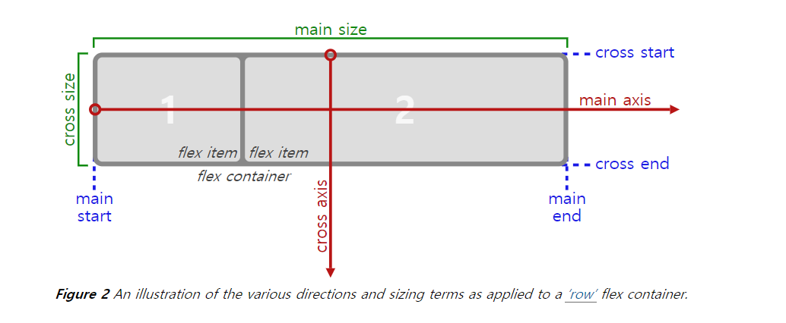

# Flexbox
> `반응형 웹` 이라 함은 다양한 뷰포트에 대하여 화면이 자동으로 그에 맞게 변하도록 하는 웹페이지를 말한다. 이는 컴퓨터의 모니터, 스마트폰, 태블릿 등 다양한 디바이스에서 웹페이지를 불러오게 되기 때문에 이에 맞게 자연스러운 레이아웃을 보여주는 것이 필요해졌기 때문이다.

반응형 웹을 구현하기 위해서는 다양한 기술들이 있지만 이 레포지토리에서는 CSS3의 `Flexbox`의 기능에 대해 알아보도록 한다. `Flexbox`의 기본적인 성질과 사용법에 대해 익히고 각각의 속성에 따라 화면이 어떻게 변하는지 알아보도록 한다.  
 

### Flexbox의 구성
  

Flex의 구성은 여러 자식요소인 flex item과 상위 부모 요소인 flex container로 이루어져 있다. 위 사진[1](#footnote_1)을 참고하면서 다음 flexbox가 동작하는 방식을 이해하도록 한다.  

#### flex-direction
자식요소의 나열 방향을 지정하는 속성이다. 기본값은 `'row'`이며 `'row-reverse'`, `'column'`, `'column-reverse'` 가 있다.  
 

<iframe height="300" style="width: 100%;" scrolling="no" title="Untitled" src="https://codepen.io/bbangso0322/embed/zYdxbMe?default-tab=html%2Cresult" frameborder="no" loading="lazy" allowtransparency="true" allowfullscreen="true">
  See the Pen <a href="https://codepen.io/bbangso0322/pen/zYdxbMe">
  Untitled</a> by 방소윤 (<a href="https://codepen.io/bbangso0322">@bbangso0322</a>)
  on <a href="https://codepen.io">CodePen</a>.
</iframe>

 
<a name="footnot_1">1 </a>: 사진 출처 - https://www.w3.org/TR/css-flexbox-1/#box-model